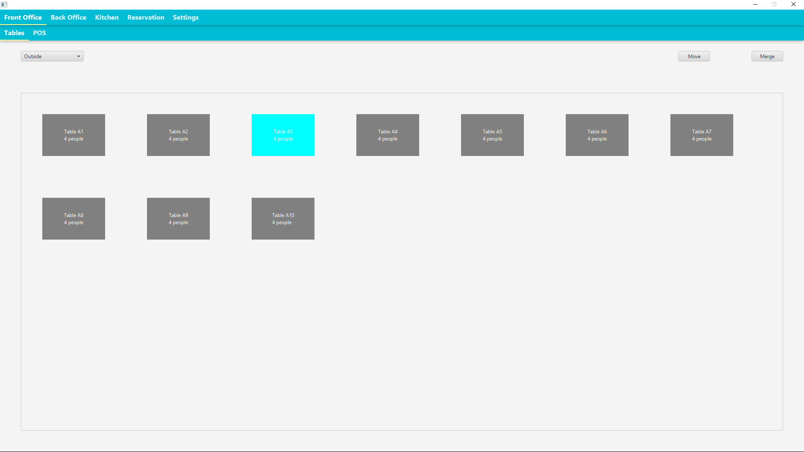
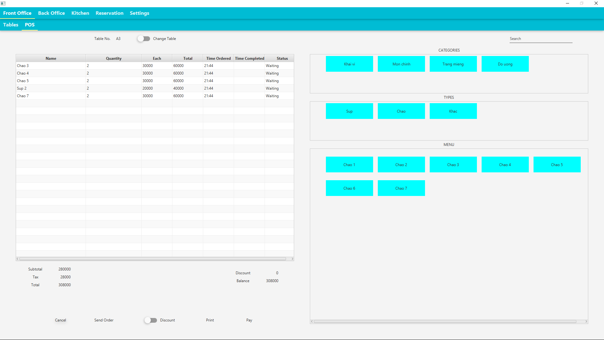
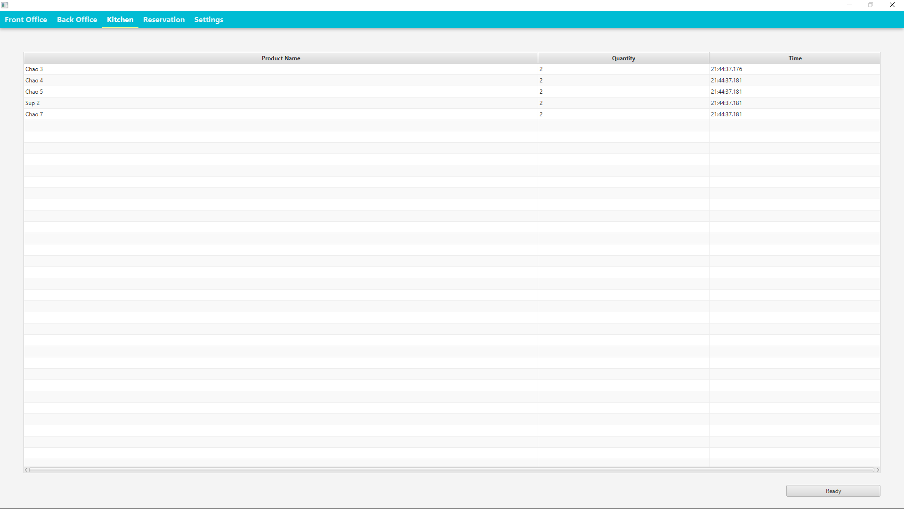
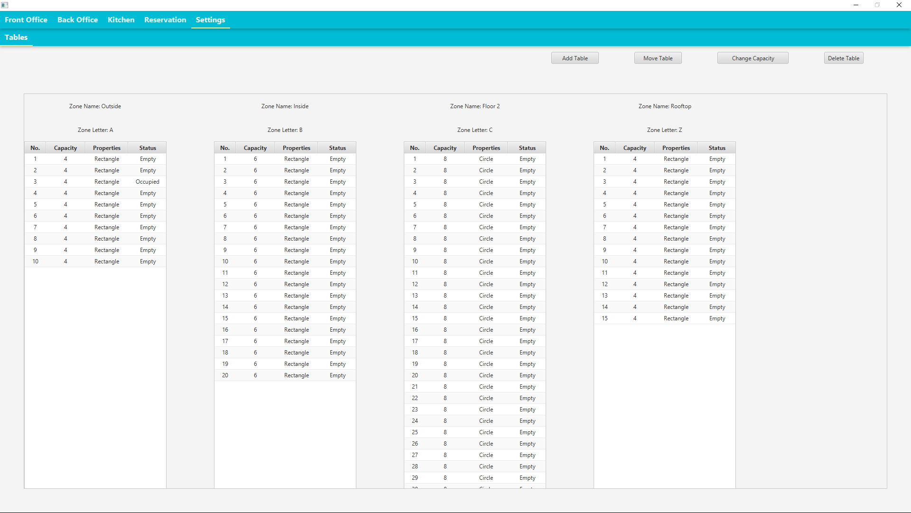

# Restaurant Management Software
A side project that I have done in Summer 2019 to learn more about JavaFX.

## Table of contents
* [General Info](#general-information)
* [Technologies Used](#technologies-used)
* [Features](#features)
* [Screenshots](#screenshots)
* [Project Status](#project-status)
* [Room for Improvement](#room-for-improvement)
* [Contact](#contact)

## General Information
- A point-of-sale interface that can be used in restaurants.
- This project tends to solve the problem of creating a smooth process from accommodating customers in the restaurant, creating orders for the kitchen to making receipts and such; in short, organizing the flow of a restaurant.
- I have always been interested in hotel/restaurant mangement softwares and such organizing systems on desktop, hence I chose to make this project when I need to learn and practice JavaFX for my internship during Summer 2019.

## Technologies Used
- JavaFX - version 3.0.0
- JFoenix - version 8.0.10

## Features
- Availability and accomodation: By having the table map displayed and can be interacted, one can know about the restaurant's available space, as well as status of the tables (empty, occupied, or waiting for food...).
- Ordering: The restaurant's menu can be displayed and customers can choose from those, and afterwards these orders will be sent to the kitchen counter automatically.
- Receipt: Calculate the receipt for the table, then change the table's status to empty, waiting for new customer.

## Screenshots
- Front Office

- Kitchen

- Settings

## Project status
This project is no longer being worked on. When I felt like I had gained enough knowledge about JavaFX to work for the team, I slowly stop working on this project. However, there are still room for improvement and one day I might continue this from where I left off.

## Room for improvement
- Create more features relating to "Back office" (total spent, total benefit,...) and "Reservation".
- Separate into a client-side (which can be found [_here_]()) and a server-side (which can be found [_here_]()).

## Contact
Created by [@Sorairono](https://github.com/Sorairono) - feel free to contact me!
